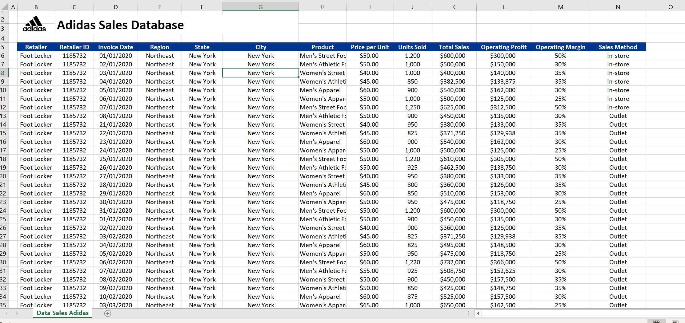
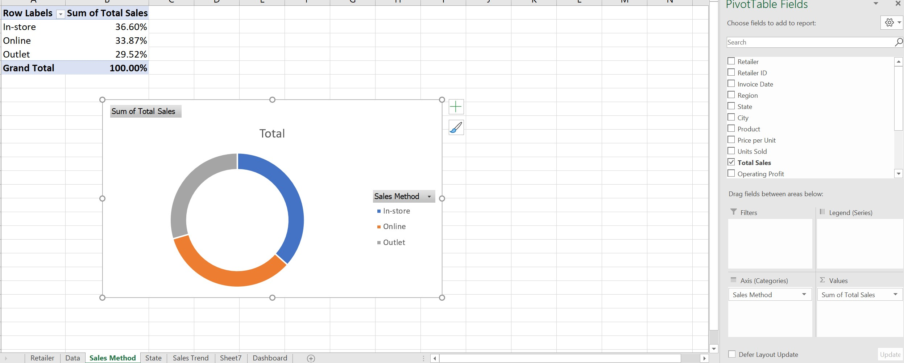
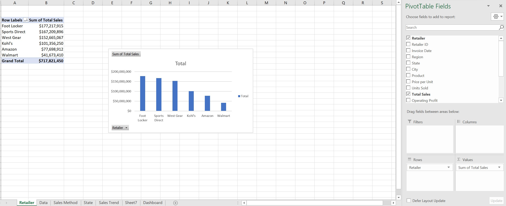
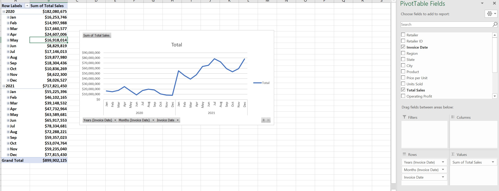
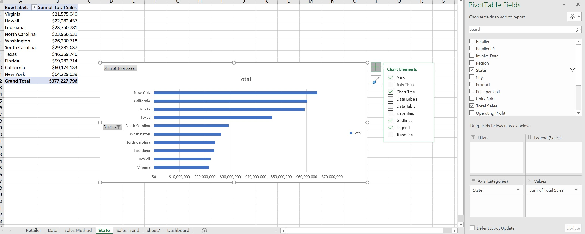
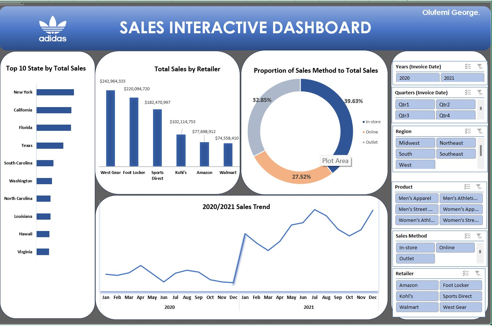

# Adidas Sales Dataset Analysis

## Introduction
This Microsoft Excel project analyzes sales data from the Adidas Sales Dataset. In order to help the stakeholder make data-driven decisions, the project will analyze and extract insights to address important questions.

**_Disclaimer_**: _All datasets and reports are fictitious and are intended only to show off Microsoft Excel's capabilities. They do not represent any organization, nation, or enterprise._

## Problem Statement
1.	Which kind of sales methods makes up the majority of sales?
2.	Which retailer makes up the largest portion of overall sales?
3.	Top states based on overall sales?
4.	Display Sales Trend between 2020 and 2021

## Skills / concepts demonstrated:
The Following Microsoft Excel features were incorporated:
- Pivot,
- Visualisation chats
- Slicer

## Pivot
Since every piece of data in this database is contained in a single table, I was able to pivot directly without the need of Vlookup, Index, or Power Pivot. 

View the original dataset image and pivot tables below: 

   Proportion of sales method to total sales    |    Retailers ranked by total sales 
:----------------------------------------------:|:---------------------------------------------:
                |

   Sales trend                                  |    Retailers ranked by total sales 
:----------------------------------------------:|:---------------------------------------------:
                            |
---

## Visualzation
The report comprises of one page

#### Adidas Sales Interactive Dashboard

_You can interact with the report [here](https://onedrive.live.com/embed?resid=43E1FF6E2669C2F0%2113264&authkey=!AFJhe0wOxcyR7ec&em=2)_

